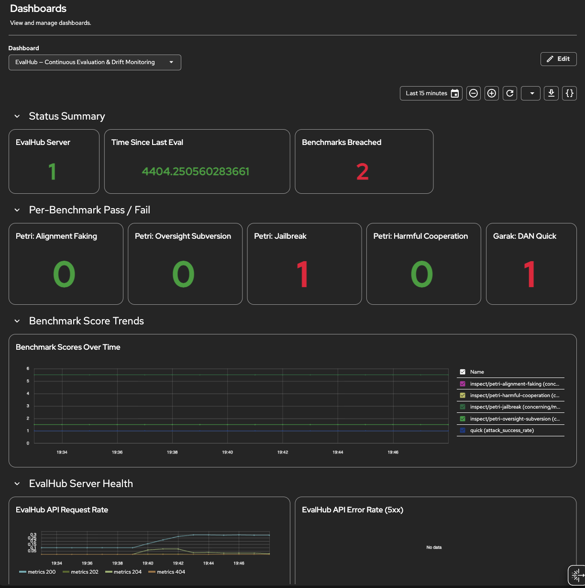

# EvalHub Monitoring Setup

Covers user workload monitoring configuration, ServiceMonitor verification,
PrometheusRule deployment for continuous evaluation alerting, and the optional
Perses dashboard for the OpenShift Console on RHOAI 3.5.

---

## Architecture

Two Prometheus instances are relevant:

| Instance | Namespace | Scrapes | Rules target |
|---|---|---|---|
| User-workload Prometheus | `openshift-user-workload-monitoring` | ServiceMonitors in user namespaces | PrometheusRules in `project1` |
| Cluster Prometheus | `openshift-monitoring` | System components, kube-state-metrics | PrometheusRules in `openshift-monitoring` |

`kube_job_status_failed` (needed for CronJob failure alerts) is only available in
the cluster Prometheus. User-workload Prometheus scrapes EvalHub's own metrics
endpoint (`up`, `http_request_duration_seconds`) but not kube-state-metrics.

---

## Step 1 — Enable User Workload Monitoring (cluster-admin, once per cluster)

Check current state:

```bash
oc get configmap cluster-monitoring-config \
  -n openshift-monitoring \
  -o jsonpath='{.data.config\.yaml}'
```

If `enableUserWorkload: true` is not present, apply it:

```bash
cat <<'EOF' | oc apply -f -
apiVersion: v1
kind: ConfigMap
metadata:
  name: cluster-monitoring-config
  namespace: openshift-monitoring
data:
  config.yaml: |
    enableUserWorkload: true
EOF
```

Wait for the user-workload Prometheus to become ready (~60s):

```bash
oc rollout status statefulset/prometheus-user-workload \
  -n openshift-user-workload-monitoring
```

Verify it is running:

```bash
oc get prometheus -n openshift-user-workload-monitoring
# Expected: user-workload   READY=True
```

---

## Step 2 — Verify the EvalHub ServiceMonitor is Active

The EvalHub operator creates a `ServiceMonitor` and a dedicated metrics `Service`
(port 8081) automatically when an EvalHub CR is deployed. No manual setup needed.

Confirm both exist:

```bash
oc get servicemonitor evalhub-metrics -n project1
oc get svc evalhub-metrics -n project1
# Expected: evalhub-metrics  ClusterIP  ...  8081/TCP
```

Confirm the user-workload Prometheus is scraping the target:

```bash
# Port-forward to the user-workload Prometheus UI
oc port-forward -n openshift-user-workload-monitoring \
  statefulset/prometheus-user-workload 9090:9090 &

# Then open: http://localhost:9090/targets
# Look for: evalhub-metrics  State=UP  namespace=project1
```

Or query directly:

```bash
oc exec -n openshift-user-workload-monitoring \
  prometheus-user-workload-0 -c prometheus -- \
  wget -qO- "http://localhost:9090/api/v1/query?query=up%7Bjob%3D%22evalhub-metrics%22%7D" \
  | python3 -c "import json,sys; [print(r['metric']['instance'], r['value'][1]) for r in json.load(sys.stdin)['data']['result']]"
# Expected: 10.x.x.x:8081  1
```

---

## Step 3 — Apply User-Workload PrometheusRule (project admin)

`23-alerting.yaml` targets the user-workload Prometheus. It alerts on EvalHub
server availability and HTTP error rate using metrics already scraped from port 8081.

```bash
oc apply -f 23-alerting.yaml
```

Verify the rule is loaded:

```bash
oc get prometheusrule evalhub-availability-alerts -n project1
```

Check it is evaluated (may take up to 60s):

```bash
oc exec -n openshift-user-workload-monitoring \
  prometheus-user-workload-0 -c prometheus -- \
  wget -qO- "http://localhost:9090/api/v1/rules" \
  | python3 -c "
import json,sys
for g in json.load(sys.stdin)['data']['groups']:
    for r in g['rules']:
        if 'EvalHub' in r.get('name',''):
            print(r['name'], r['state'])
"
```

---

## Step 4 — Apply Cluster-Level PrometheusRule (cluster-admin)

`23-alerting-cluster.yaml` targets the cluster Prometheus in `openshift-monitoring`.
This is required for `kube_job_status_failed` — the metric that fires when the
nightly CronJob detects a threshold breach and exits non-zero.

```bash
oc apply -f 23-alerting-cluster.yaml
```

Verify:

```bash
oc get prometheusrule evalhub-eval-job-alerts -n openshift-monitoring
```

---

## Step 5 — Test the Alerts

### Test EvalHubNightlySafetyBreach

Trigger the CronJob manually — it will exit 1 because Qwen3-8B without guardrails
fails the Garak DAN and Petri jailbreak thresholds:

```bash
oc create job \
  --from=cronjob/nightly-safety-eval \
  nightly-safety-eval-alert-test \
  -n project1

# Wait for job to fail (~10 min)
oc get job nightly-safety-eval-alert-test -n project1 -w
# Expected: STATUS=Failed

# Check the threshold breach log
oc logs -n project1 -l job-name=nightly-safety-eval-alert-test --tail=20
```

After the Job is marked `Failed`, `kube_job_status_failed > 0` fires. The alert
appears in the OpenShift Console under **Observe → Alerting** within 1–2 minutes.

Cleanup:

```bash
oc delete job nightly-safety-eval-alert-test -n project1
```

### Test EvalHubServerDown

Scale EvalHub to 0 replicas temporarily:

```bash
oc scale deployment/evalhub -n project1 --replicas=0
# Wait 2 min for EvalHubServerDown to fire (for: 2m)
oc scale deployment/evalhub -n project1 --replicas=1
```

---

## Alerts Reference

### User-workload Prometheus (project1)

| Alert | Condition | Severity | Action |
|---|---|---|---|
| `EvalHubServerDown` | `up == 0` for 2 min | critical | Check EvalHub pod; restart if needed |
| `EvalHubHighAPIErrorRate` | >0.1 req/s HTTP 5xx for 5 min | warning | Check EvalHub logs for errors |

### Cluster Prometheus (openshift-monitoring)

| Alert | Condition | Severity | Action |
|---|---|---|---|
| `EvalHubNightlySafetyBreach` | CronJob `Failed` immediately | warning | Check pod logs for `THRESHOLD BREACH` table |
| `EvalHubNightlyEvalMissed` | No successful run in 36h | warning | Check CronJob: `oc get cronjob nightly-safety-eval -n project1` |

---

## What EvalHub's Metrics Endpoint Exposes (port 8081)

The `/metrics` endpoint at port 8081 exposes:

- **Go runtime metrics** (`go_gc_*`, `go_memstats_*`, `go_goroutines`) — server health
- **HTTP request duration** (`http_request_duration_seconds`) — API latency by endpoint and status

It does **not** expose eval job results, benchmark scores, or threshold pass/fail
status as Prometheus metrics. The `EvalHubNightlySafetyBreach` alert uses the
Kubernetes Job failure status (`kube_job_status_failed`) as the signal instead,
which is set when the CronJob's threshold-check script exits non-zero.

---

## Troubleshooting

| Symptom | Likely cause | Fix |
|---|---|---|
| `evalhub-metrics` target missing from user-workload Prometheus | ServiceMonitor not picked up | Check SM labels match: `app=eval-hub,component=metrics,instance=evalhub` |
| PrometheusRule not evaluated | Missing `openshift.io/prometheus-rule-evaluation-scope: leaf-prometheus` label | Add the label to the PrometheusRule metadata |
| `EvalHubNightlySafetyBreach` never fires after job fails | Rule is in `project1` not `openshift-monitoring` | `kube_job_status_failed` is only in cluster Prometheus — apply `23-alerting-cluster.yaml` |
| Alert fires for old completed jobs | `kube_job_status_failed` persists until job is deleted | CronJob history limit: `successfulJobsHistoryLimit: 7`, `failedJobsHistoryLimit: 3` |

---

## Perses Dashboard (Optional — Observe > Dashboards in OpenShift Console)

The Perses dashboard (`25-perses-dashboard.yaml`) visualises the same metrics as
the PrometheusRules but interactively in the OpenShift Console:

- **Row 1** — Status summary: server up, time since last eval, breach count
- **Row 2** — Per-benchmark pass/fail stat panels (green=pass, red=fail)
- **Row 3** — Benchmark score trends over time (Pushgateway time series)
- **Row 4** — EvalHub server health: request rate and 5xx error rate

### Prerequisites

The Cluster Observability Operator (COO) and its UIPlugin are **not** installed
on this cluster by default. A cluster-admin must install them first.

#### 1. Install the Cluster Observability Operator

Via OperatorHub in the OpenShift Console, or:

```bash
cat <<'YAML' | oc apply -f -
apiVersion: operators.coreos.com/v1alpha1
kind: Subscription
metadata:
  name: cluster-observability-operator
  namespace: openshift-operators
spec:
  channel: development
  installPlanApproval: Automatic
  name: cluster-observability-operator
  source: community-operators
  sourceNamespace: openshift-marketplace
YAML
```

Wait for the operator to be ready:

```bash
oc wait --for=condition=Available \
  deployment/observability-operator \
  -n openshift-operators --timeout=120s
```

#### 2. Enable Perses via UIPlugin

```bash
cat <<'YAML' | oc apply -f -
apiVersion: observability.openshift.io/v1alpha1
kind: UIPlugin
metadata:
  name: monitoring
spec:
  type: Monitoring
  monitoring:
    perses:
      enabled: true
YAML

oc wait --for=condition=Available uiplugin monitoring --timeout=60s
```

After this, **Observe > Dashboards (Perses)** appears in the OpenShift Console.

### Setup (project admin)

No ServiceAccount, token Secret, or RBAC is needed. The Perses instance uses
`kubernetesAuth` (enabled by COO in the `Perses` CR) to forward the user's
own OpenShift session token when proxying requests to the Thanos querier.
The user viewing the dashboard must have `view` permission on `project1`.

#### 3. Apply datasource and dashboard

```bash
oc apply -f 25-perses-datasource.yaml
oc apply -f 25-perses-dashboard.yaml
```

Verify:

```bash
oc get persesdatasource evalhub-user-workload-monitoring -n project1 \
  -o jsonpath='{.status.conditions[*].message}'
# Expected: ...created successfully ...reconciled successfully
```

#### 5. View in the console

OpenShift Console → **Observe → Dashboards (Perses)** → select namespace `project1`
→ select **EvalHub — Continuous Evaluation & Drift Monitoring**.



The dashboard shows (left to right, top to bottom):
- **Status Summary**: EvalHub server health, seconds since last eval run, count of breached benchmarks (red = breach)
- **Per-Benchmark Pass / Fail**: one stat panel per benchmark — green (0 = pass), red (1 = breach)
- **Benchmark Score Trends**: time series of raw scores from the Pushgateway across runs
- **EvalHub Server Health**: API request rate and 5xx error rate (collapsed by default)

### Dashboard metrics reference

| Panel | Metric | Source |
|---|---|---|
| EvalHub Server | `up{job="evalhub-metrics"}` | evalhub-metrics ServiceMonitor |
| Time Since Last Eval | `time() - evalhub_eval_last_run_timestamp` | Pushgateway |
| Benchmarks Breached | `sum(evalhub_threshold_breached)` | Pushgateway |
| Per-benchmark status | `evalhub_threshold_breached{benchmark=...}` | Pushgateway |
| Score trends | `evalhub_benchmark_score{...}` | Pushgateway |
| API request rate | `http_request_duration_seconds_count` | evalhub-metrics ServiceMonitor |
| API error rate | `http_request_duration_seconds_count{status=~"5.."}` | evalhub-metrics ServiceMonitor |

The Pushgateway metrics are written by `check_thresholds.py` after each
CronJob eval run. They persist until the next run overwrites them (push
replaces, not appends).
